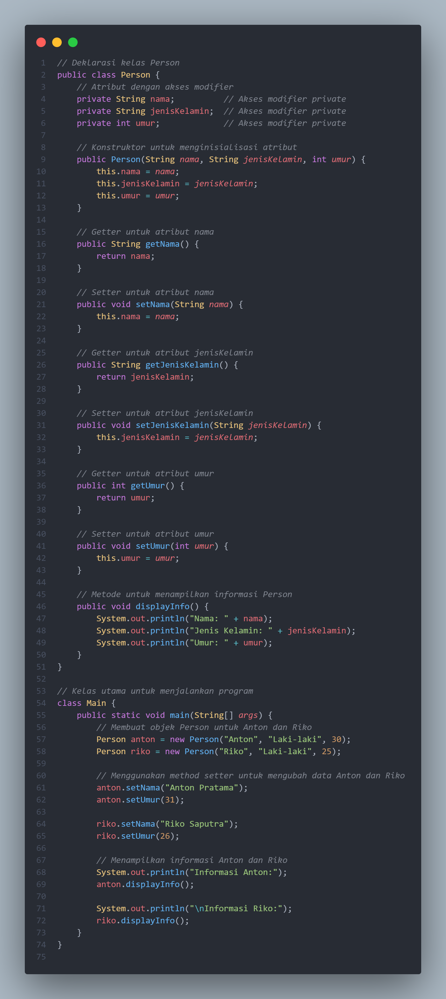

# Enkapsulasi
<b>praktikum2</b>

1. <b>Deklarasi Kelas Person</b>
```private String nama;```
Atribut nama disimpan secara pribadi dalam kelas dan tidak bisa diakses langsung dari luar kelas.<br>
```private String jenisKelamin;```
Atribut ```jenisKelamin ```juga bersifat privat dan berfungsi menyimpan data jenis kelamin dari setiap ```objek Person.```<br>
```private int umur;```
Atribut umur digunakan untuk menyimpan umur, bersifat privat sehingga hanya bisa diakses melalui metode di dalam kelas.
<br>Akses modifier private digunakan agar atribut-atribut ini tidak bisa diakses langsung dari luar kelas, melainkan hanya melalui metode``` getter``` dan``` setter.```

2. <b>Konstruktor Kelas </b> ```Person```
```java
public Person(String nama, String jenisKelamin, int umur) {
    this.nama = nama;
    this.jenisKelamin = jenisKelamin;
    this.umur = umur;
}
```
Konstruktor ini adalah sebuah metode khusus yang dipanggil saat objek Person dibuat. Ia menerima tiga parameter ```(nama, jenisKelamin, dan umur) ```yang digunakan untuk menginisialisasi nilai atribut-atribut dari objek tersebut. Kata kunci this digunakan untuk merujuk pada atribut kelas Person saat ini.

3. <b>Getter (Accessor)</b>
```public String getNama()```
Metode ini mengembalikan nilai dari atribut nama. Digunakan untuk mengakses nama tanpa langsung menyentuh atribut private.
```public String getJenisKelamin()```
Sama seperti``` getNama()```, metode ini mengembalikan nilai dari atribut jenisKelamin.
``public int getUmur()```
Mengembalikan nilai atribut ```umur.```
<b>Getter </b>adalah metode untuk mengambil data dari atribut yang bersifat privat, sehingga program di luar kelas Person tetap bisa mendapatkan informasi tersebut secara terkontrol.


4.<b> Metode</b> ```displayInfo()```
```java
public void displayInfo() {
    System.out.println("Nama: " + nama);
    System.out.println("Jenis Kelamin: " + jenisKelamin);
    System.out.println("Umur: " + umur);
}
```
Metode ini digunakan untuk mencetak informasi dari objek Person. Setiap atribut```(nama, jenisKelamin, umur)``` ditampilkan ke konsol dengan format yang rapi. Metode ini memudahkan untuk menampilkan informasi objek tanpa harus memanggil getter satu per satu.

5.<b> Kelas Main</b>
<b>Membuat Objek</b> ```Person```

```java
Person anton = new Person("Anton", "Laki-laki", 30);
Person riko = new Person("Riko", "Laki-laki", 25);
```
Di sini, kita membuat dua objek ```Person```, yaitu ```anton dan riko```, dengan menggunakan konstruktor kelas ```Person```. Saat objek ini dibuat, kita langsung menetapkan nilai ```nama, jenisKelamin, dan umur``` dengan memberikan argumen pada konstruktor.

<b>Menampilkan Informasi Objek</b>
```java
anton.displayInfo();
riko.displayInfo();
```
Setelah objek dibuat, kita memanggil metode ```displayInfo()``` untuk menampilkan informasi dari masing-masing objek ```anton``` dan ```riko```. Metode ini mencetak ke konsol atribut-atribut yang ada pada objek tersebut.<br>
## <b> Hasil utputnya</b>


Ringkasan:
Program ini mendefinisikan kelas Person dengan atribut nama, jenisKelamin, dan umur. Atribut-atribut ini memiliki akses modifier private, sehingga tidak bisa diakses langsung dari luar kelas. Program kemudian menggunakan getter untuk mendapatkan informasi dari atribut privat tersebut dan menampilkan informasi menggunakan metode displayInfo(). Di dalam kelas utama, dua objek Person dibuat dengan nama anton dan riko, dan informasi mereka ditampilkan ke konsol.

Program ini menunjukkan cara dasar mendeklarasikan kelas, atribut, konstruktor, dan metode, serta bagaimana objek dibuat dan digunakan di dalam program Java.
